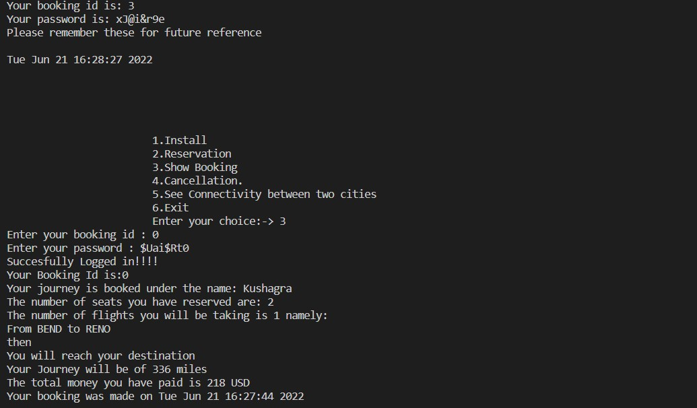

# Flight_Reservation_System
The project involves making use of Dijkstra's algorithm to develop a reservation system of the flights operating in the United States.

This was a group project made for the purpose of submission of Data Structure Lab Project given to me in my 3rd semester.

## TOOLS AND TECHNOLOGY USED:
 
 
•	Language Used: C++ , Python
•	Standard Template Library
•	Graph Theory Concepts
•	Dijkstra Algorithm
•	CSV reader
•	Python for data preprocessing               

## DATASET-
USA AIRPORT DATABASE

Original Dataset Link: https://www.kaggle.com/flashgordon/usa-airport-dataset

## DESCRIPTION:
This dataset is a record of 3.5 Million+ US Domestic Flights from 1990 to 2009. It has been taken from OpenFlights website which has a huge database of different travelling mediums across the globe.

## Original Dataset contains:
Here is some info about the attributes present in the dataset:
1.	Origin_airport: Three letter airport code of the origin airport
2.	Destination_airport: Three letter airport code of the destination airport
3.	Origin_city: Origin city name
4.	Destination_city: Destination city name
5.	Passengers: Number of passengers transported from origin to destination
6.	Seats: Number of seats available on flights from origin to destination
7.	Flights: Number of flights between origin and destination (multiple records for one month, many with flights > 1)
8.	Distance: Distance (to nearest mile) flown between origin and destination
9.	Fly_date: The date (yyyymm) of flight
10.	Origin_population: Origin city's population as reported by US Census
11.	Destination_population: Destination city's population as reported by US Census
 
## Processed Data set:

For the purpose of this project, I have toned down the dataset to 2500 rows and 7 columns using pandas and numpy library. The data has been cleaned and processed using the above said libraries in python to be made more useful and more just for the purpose of this project.

#### The processed dataset contains 7 columns which are:

1.ORIGIN_AIRPORT

2.DESTINATION_AIRPORT

3.PASSENGERS

4.SEATS

5.DISTANCE

6.DESTINATION_CITY

7.ORIGIN_CITY

## FUNCTIONS and their functionality 

1.READ RECORD: This function is acting as the CSV READER and is extracting the data from the csv file and storing it in a class object for future use.

Getline function is being used here to read the csv file row by row and the values in each column is being stored in the class flight object .So that, this can be used in the program for traversing and return values

Trimaplha function is being used so that all the special characters can be removed from the values taken from the csv and being stored in the object 

Check_key()- checks if the city exits in the database or not 

Using the chek_key function we are checking if they exist or not if they don’t we are adding them in the hashmap and if they do we are editing the value

## Dijkstra:

Applying the dijkstra algorithm to find the shortest possible path from our origin city to destination city to get the minimum fair.

The dijkstra algorithm used to get the shortest distance between the origin and the destination city .
  
For Dijkstra’s algorithm, it is always recommended to use heap (or priority queue) as the required operations (extract minimum and decrease key) match with speciality of heap (or priority queue). However, the problem is, priority_queue doesn’t support decrease key. To resolve this problem, do not update a key, but insert one more copy of it. So we allow multiple instances of same vertex in priority queue. This approach doesn’t require decrease key operation and has below important properties.

Whenever the distance of a vertex is reduced, we add one more instance of vertex in priority_queue. Even if there are multiple instances, we only consider the instance with minimum distance and ignore other instances.
The time complexity remains O(ELogV)) as there will be at most O(E) vertices in priority queue and O(Log E) is same as O(Log V) 

Just finding the shortest distance is not enough,
We will have to know which cities we will have to go through in order to reach the the destination city in the shortest distance possible like in any airline travel

To do this, we have created 2 separate vectors: ‘parent’ and ‘path’.
 
PARENT: it stores the index of the preceding vertex of the current node satisfying the minimum distance condition

PATH: stores the flight number of the flight that could be used in order to get to the current vertex while satisfying the min distance condition

To recreate the path,

We have stored all of the flight numbers from the path array from the origin city to the destination city 

#### Reserving seats:
We are first asking the origin and destination city and then checking our databases for possible combinations for such a journey and then returning the details of the flight(s) which is charging the customer with the minimum possible fare using dijkstra algorithm.

We also ask for the number of seats required 

If and only if the seats are available for the entire trip , we move forward with the reservation then we give them a booking id and password which they would need in the future for checking, 

#### Cancellation:

Here it is the function to cancel any reservation that has been made, 
authenticate function is being called, that we have created, it checks for reservation id and password and if they match any values that have been previously registered by the reservation seats function
If they exist, then we moved forward to confirm their cancellation and deduct 2/3rd usd of the initial amount, as the cancellation fee and show the cancellation message.

#### See connectivity:
 
This is the function that is called in the ‘ see connectivity between two cities ’.
It tells you to the details of the journey  without making a reservation like max seats that are currently available in all the flights you may need in that journey , the distance you will cover , the number of connecting flights for the most efficient journey, which can be taken.

Main function:

This is the driver code of the program program.
Where we have gone with a menu-driven type display and we give the user choices to use the different functionalities that we have provided in the program
This has been executed via a simple switch case code block

The functionalities are as follows:

#### 1.Install : This installs the data from the csv file to the prgram
And if it has already been installed then it shows it has already been installed

#### 2. Reservation : Calls the reserve seats function and then the user can make reservations and they will be provided with a booking id and password which they can use for further procedure
This function also checks if the database has been installed or not and if it is not , then it returns an error

If the  number of seats that the user wants is greater than the vacant seats , it lets them know seats are not available and they should retry the booking process to possibly get seats.

#### 3.Show Booking : this options returns your booking details once you are authenticated by checking your booking id and password.

#### 4.Cancellation : this option here calls the cancellation function and the cancellation procedure is followed.

#### 5.Check Connectivity Between Two Cities : This option here you might need if you might want to only check the details of the journey and not make a reservation like seats that are currently available , the distance you will cover , the number of connecting flights for the most efficient journey.

#### 6.Exit: To exit the flight booking system.

